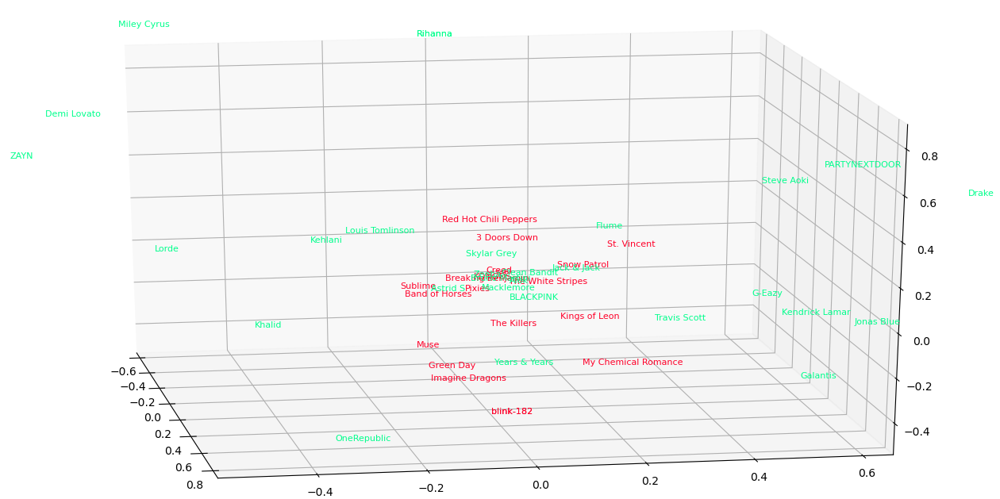
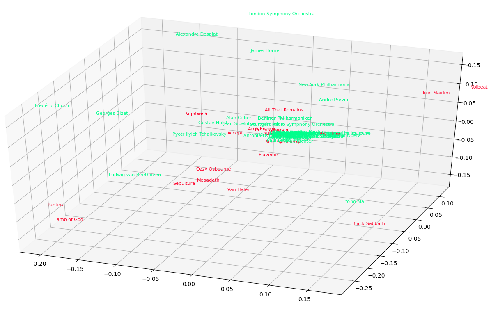

# Spotify2Vec

This project provides vector embeddings for music artists. 
This is done by calculating a global co-occurence matrix of Spotify song recommendations to train a GloVe model.

## Train your own Model

### Data

The data for the co-occurence matrix is scraped using the official Spotify API. 
I have implemented two strategies for this: depth-first, where the number of recommendations for each artist is balanced, and breadth-first, where each recommended artist serves as the next search query.
Which of these provides better embeddings has yet to be examined.

Data is stored in a MongoDB. Requests are optimized using `multiprocessing`: For every music genre a separate process is used.

To scrape your own data follow this steps:
- Create a json "credentials.json" with your Spotify API information like this:
    ```
    {
      "client_id": "...",
      "client_secret": "..."
    }
    ```
- Start a MongoDB instance (host "localhost", port 27017)
- Execute one of [scrape-breadth-first.py](./scrape-breadth-first.py) or [scrape-depth-first.py](./scrape-depth-first.py)

An important parameter here is the number of recommendations per API request (1-100). 
As you can imagine, the higher the number, the worse the quality of the embeddings. However, if the number is too low, scraping takes a long time.

### Train GloVe

Once enough data is available, the co-occurence matrix can be created
```
python create_matrix.py
```
You can then train the model:
```
python train_glove.py
```
The resulting embeddings are stored as *.npy* file.
To use them later with `gensim` or similar, they can be written into a text file using `python make_txt.py`.

## Results

I have not yet evaluated the results with any downstream task, just created some fancy visualizations.
Here are some of them:

- Alternative vs. Pop Artists


- Metal vs. Classic Artists
